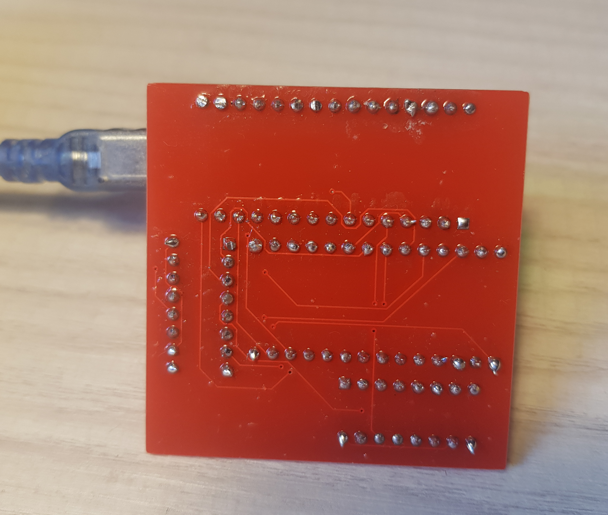

This is a fork of the Ben Eater's version of the EEPROM programmer, originally licensed under MIT LICENSE.

I did not like the fact of having it on a breadboard or buying it so I made a PCB.

~~I still have to solder and check that the circuit is working.~~
~~When I'm sure it's working I will upload the KiCad files.~~
It looks like it is working.

TODO:
  I will also do my own version of the code.
  Documentation
